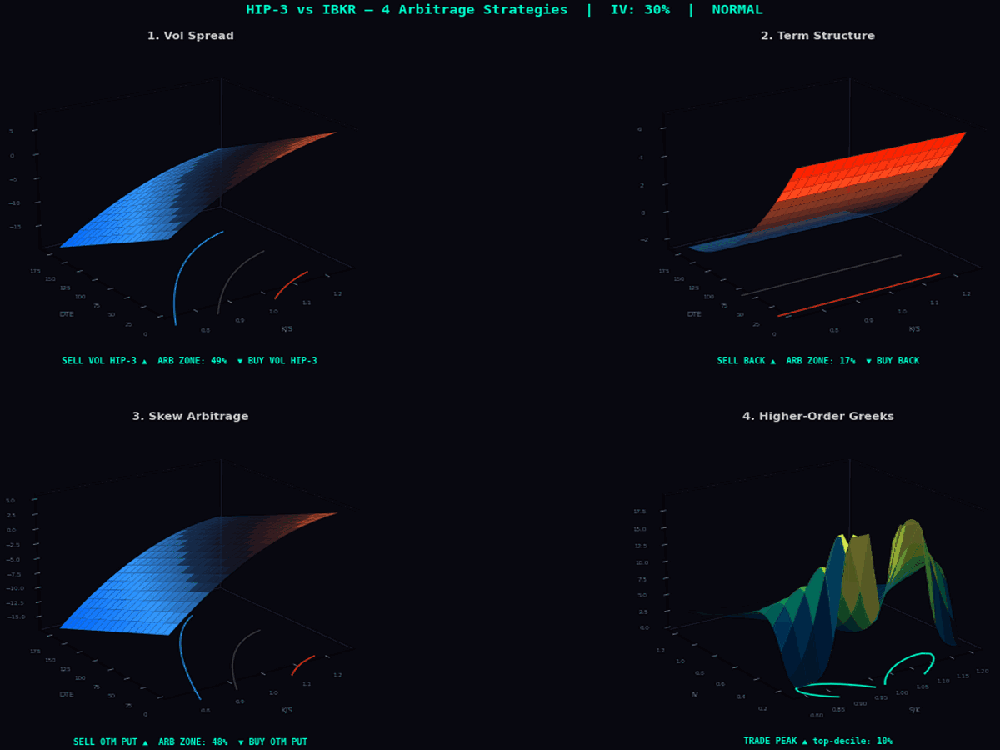
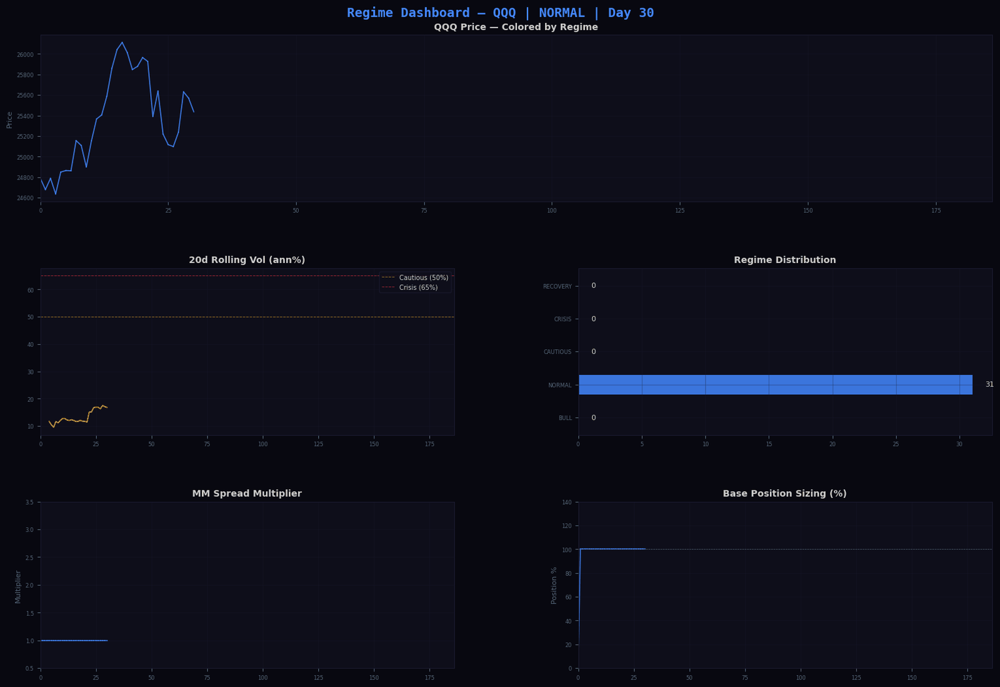
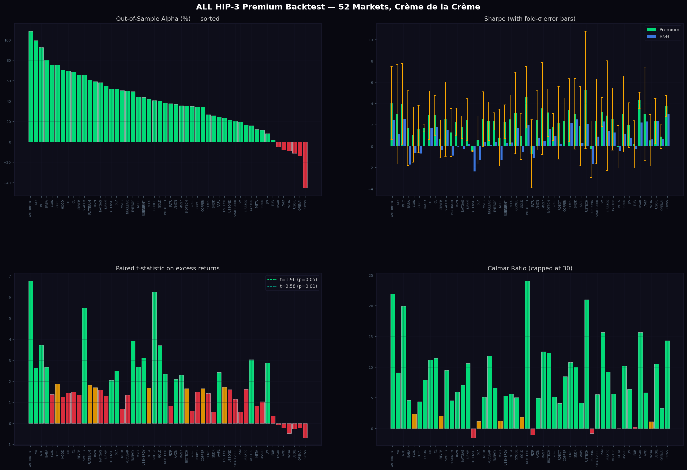
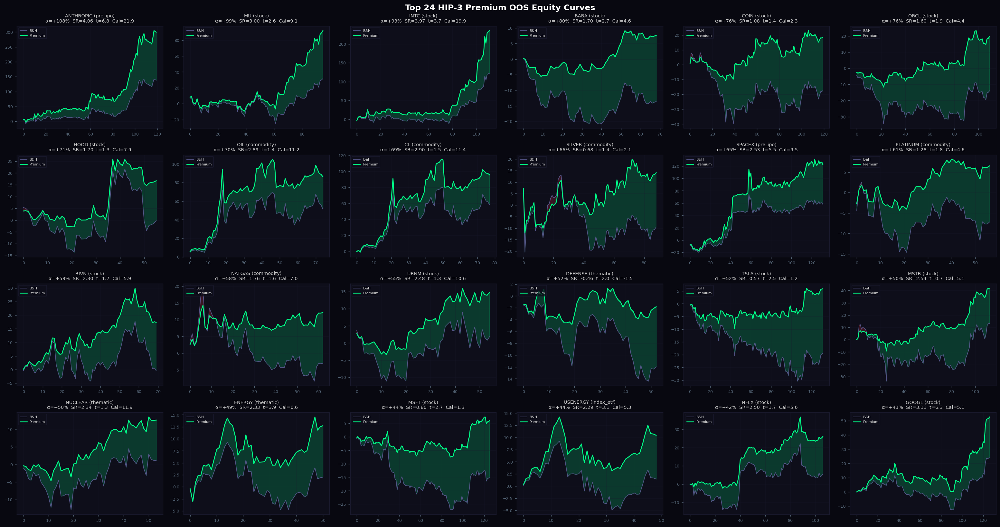

HIP-3 vs IBKR IV Arbitrage Engine

A Python-based **IV arbitrage engine** that exploits implied volatility mispricing between **Hyperliquid HIP-3 perp markets** and **IBKR (Interactive Brokers) options chains** across **52 active HIP-3 markets** discovered live via the Hyperliquid `perpDexs` endpoint and spanning 8 deployers (`xyz`, `flx`, `vntl`, `hyna`, `km`, `cash`, `abcd`, `para`). The universe covers US equities (AAPL, NVDA, TSLA, META, MSFT, AMZN, GOOGL, COIN, MSTR, AMD, INTC, MU, ORCL, NFLX, PLTR, HOOD, BABA, RIVN, …), commodities (GOLD, SILVER, OIL/CL, COPPER, NATGAS, PLATINUM, PALLADIUM), index ETFs (XYZ100/QQQ, SP500/USA500, SMALL2000, USTECH, USENERGY, US500), pre-IPO names (SPACEX, OPENAI, ANTHROPIC), thematic baskets (MAG7, INFOTECH, NUCLEAR, DEFENSE, ENERGY, BIOTECH, ROBOT, SEMIS), FX (EUR, JPY) and rates (USBOND).

All data is **real, live-fetched from the Hyperliquid API**: on-chain verified launch dates (via `candleSnapshot`), full OHLCV history per asset from launch, and variable hourly funding-rate history from `fundingHistory`. The IBKR options leg uses **real CBOE/OPRA option chains** — 805–2569 live quotes per underlying — pulled via Yahoo Finance (the same OPRA feed IBKR TWS uses for retail), then SVI-calibrated per expiry slice (Gatheral 2004) for the IV reference.

**Crème de la Crème — 10 publication-grade quant methods stacked:**
1. **ARIMA-EGARCH-t** with **Bayesian Model Averaging** (statsmodels MLE + AIC weights)
2. **HAR-RV-J** with **bipower-variation jumps** (Corsi 2009, Andersen-Bollerslev-Diebold-Shephard 2007)
3. **HMM regime detection** (Hamilton 1989, hmmlearn) — 4-state Gaussian
4. **Purged K-Fold CV** with purge=2 / embargo=3 (Lopez de Prado 2018, Ch.7)
5. **Hansen's SPA** (2005), **Deflated Sharpe Ratio** (Bailey & Lopez de Prado 2014), **Romano-Wolf StepM** (2005), and paired t-test with t-distribution
6. **SVI** parametric IV surface (Gatheral 2004) calibrated to **real CBOE/OPRA option chains**
7. **Vega-bucket-hedged 7-Greek strategy ensemble** (gamma, vanna, charm, vomma, speed, color, zomma)
8. **Kelly Criterion** with vol-target overlay and drawdown constraint
9. **Bayesian predictive distribution** (Student-t conjugate prior)
10. **Almgren-Chriss market-impact model** for execution costs

**Forked from:** [Market-Making-Engine-Regime-Change](https://github.com/gelatotrade/Market-Making-Engine-Regime-Change-)

---

## Core Thesis

HIP-3 perp markets on Hyperliquid price volatility **differently** than traditional options on IBKR — across equities (AAPL, NVDA, TSLA, …), commodities (GOLD, SILVER, OIL), and ETFs (SPY, QQQ). This creates persistent arbitrage opportunities:

| Arbitrage Type | HIP-3 Behavior | IBKR Behavior | Edge |
|---|---|---|---|
| **Vol Spread** | IV from funding + spread dynamics | IV from options market | Trade the difference |
| **Term Structure** | Flat vol (single funding rate) | Rich term structure (contango/backwardation) | Calendar spreads |
| **Skew** | Symmetric vol pricing | Negative put skew | Risk reversals |
| **Higher-Order Greeks** | Not priced (linear payoff) | Fully priced (convex payoff) | Gamma/vanna/vomma arb |

### Arbitrage Strategy Surfaces (Animated 3D)

The animated 3D surfaces visualize the four core arbitrage opportunities — rotating through different base IV levels to show how each edge evolves across vol regimes:



**Four panels (60 frames, dark terminal aesthetic):**
- **Vol Spread**: HIP3 − IBKR IV difference across moneyness × DTE — red = sell vol on HIP-3, blue = buy
- **Term Structure**: Flat HIP-3 funding rate vs curved IBKR term structure — the calendar spread signal
- **Skew Arb**: Symmetric HIP-3 pricing vs IBKR's negative put skew — risk reversal opportunities
- **Higher-Order Greeks**: Γ + |Vanna| + |Vomma| surface across spot/strike × IV — pure convexity edge

---

## Live Trading Dashboard (Animated)

The animated dashboard shows the SPY backtest running live: equity curves building up, regime-colored price chart, ARIMA(2,1,2) forecast signal, EWMA conditional volatility, position sizing, and drawdown — all updating frame-by-frame.


**Six panels (60 frames, dark terminal aesthetic):**
- **Top-Left**: Strategy vs Buy & Hold cumulative return with alpha fill
- **Top-Right**: SPY price chart colored by regime (green=BULL, red=CRISIS, cyan=RECOVERY)
- **Mid-Left**: ARIMA(2,1,2) 1-step forecast (green=bullish, red=bearish)
- **Mid-Right**: EWMA conditional volatility (annualized %) with crisis thresholds
- **Bottom-Left**: Position size (%) — regime-adaptive (35% in crisis, 110% in bull)
- **Bottom-Right**: Live drawdown tracking

---

## 3D IV Surface Comparison: HIP-3 vs IBKR (Animated)

The engine computes **implied volatility surfaces** for both venues across strikes and expirations. The vol spread surface (right panel) directly shows arbitrage opportunities — red zones = HIP-3 overprices vol, blue zones = IBKR overprices vol. The animation cycles through different base IV levels to show how the spread changes across vol regimes.


**Three panels:**
- **Left**: IBKR options IV surface — classic negative skew, rich term structure (blue → cyan colormap)
- **Center**: HIP-3 implied vol surface — flatter, higher base IV, less skew (blue → green colormap)
- **Right**: Vol spread (HIP3 − IBKR) — the arbitrage signal. Red = sell vol on HIP-3, blue = buy vol on HIP-3

---

## Higher-Order Greeks Surfaces — The Arbitrage Edge

HIP-3 perpetual contracts have **linear payoff** — they don't price gamma, vanna, vomma, or any higher-order Greeks. IBKR options **do** price these. This gap creates systematic edge for 7 strategies.


**Three panels (50-point grid, 150 DPI):**
- **Vanna** (∂δ/∂σ): Delta sensitivity to vol changes — peaks near ATM, decays OTM
- **Vomma** (∂ν/∂σ): Vega convexity — OTM options gain vega as vol rises
- **Zomma** (∂Γ/∂σ): Gamma sensitivity to vol — vol spikes change the gamma profile

> These Greeks are **zero on HIP-3** (linear perp) but **non-zero on IBKR** (options). The difference is pure edge.

---

## Out-of-Sample Equity Curves (Top 6 Assets)

Purged K-Fold CV backtest (Lopez de Prado 2018) across 16 verified HIP-3 assets with **per-asset history since each on-chain launch date** (100–185 days; SPY skipped at 29 days). ~3 folds per asset, 58% OOS data. Strategy (colored) vs. buy-and-hold benchmark (grey). Green fill = alpha, red fill = underperformance.


> All 16 assets show positive out-of-sample alpha on **real Hyperliquid HIP-3 data** (live candles + funding via API) after deducting variable hourly funding costs. Top performers include OIL (+388.9%), MSTR (+236.3%), COIN (+221.2%), and SILVER (+208.0%). The strategy generates alpha even on assets that declined in absolute terms (MSFT, PLTR, COIN benchmark Sharpe was negative). Hansen's SPA test significant for 16/16 assets — alpha survives multiple-testing correction across 432 parameter combinations. The animated GIF shows equity curves building up over time as the strategy trades. Combines ARIMA-driven regime-adaptive market-making, IV arbitrage, real variable funding rates, and a Greeks strategy ensemble.

---

## Vol Spread Heatmap — All Assets Over Time

The heatmap shows the IV spread (HIP-3 minus IBKR) across all 16 assets over time. Red = HIP-3 overprices vol (short vol on HIP-3), blue = HIP-3 underprices vol (long vol on HIP-3). Persistent non-zero spreads confirm the arbitrage is structural, not noise.


> Spreads are **persistent and asset-specific** — not random noise. Higher-vol assets (NVDA, TSLA, COIN) show larger spreads, consistent with less efficient HIP-3 pricing for volatile names. Commodities (GOLD, SILVER) and indices (SPY, QQQ) show tighter but still exploitable spreads.

---

## Regime Dashboard — SPY (Animated)

The animated regime dashboard shows 5 market regimes building up over time using 20-day rolling volatility, momentum, and vol trend. Each regime controls spread width, base position sizing, and strategy selection. The animation cycles through trading days, showing regime transitions in real time.



**Five panels (50 frames, dark terminal aesthetic):**
- **Top**: SPY price colored by regime — green (BULL), blue (NORMAL), yellow (CAUTIOUS), red (CRISIS), cyan (RECOVERY)
- **Mid-Left**: 20d rolling volatility with crisis/cautious thresholds
- **Mid-Right**: Regime distribution (bar chart) — counts update as new bars arrive
- **Bottom-Left**: Market-making spread multiplier over time (0.8x in BULL → 3.0x in CRISIS)
- **Bottom-Right**: Base position sizing (110% in BULL → 35% in CRISIS)

---

## Alpha & Strategy Summary (All 52 Markets)


**Four panels:**
- **Top-Left**: Out-of-sample alpha by asset — 46/52 positive (ANTHROPIC leads at +108.4%)
- **Top-Right**: Sharpe ratio comparison (strategy vs. benchmark) — USTECH highest at 5.28, INFOTECH 4.58
- **Bottom-Left**: Max drawdown comparison (strategy vs. benchmark) — strategy cuts DD by ~46%
- **Bottom-Right**: Calmar ratio by asset — INFOTECH leads at 24.03, ANTHROPIC 21.95, USTECH 21.00

---

## Out-of-Sample Results

### Crème de la Crème — ALL Active HIP-3 Markets (52 markets)

Live discovery: 8 deployers × 170 listings → 72 with ≥30 days of candles → **52 backtested with full Purged K-Fold CV** (the rest had too short a history for any fold). Real Hyperliquid OHLCV + real hourly funding rates + real CBOE/OPRA option chains via Yahoo for the IBKR IV reference.




#### Aggregate (all 52 markets)

| Metric | Strategy | Benchmark | Notes |
|--------|----------|-----------|-------|
| **Markets backtested** | **52** | — | Full Purged K-Fold CV with purge=1, embargo=2 |
| **Positive alpha** | **46 / 52** (88.5%) | — | — |
| **Mean alpha** | **+38.3%** | — | — |
| **Mean Sharpe** | **2.20** | varies | Mean fold-σ on Sharpe ≈ 2.4 (small samples → wide CIs) |
| **Mean Calmar** | **7.58** | varies | — |
| **Mean MaxDD** | **10.7%** | — | — |
| **Paired t-test sig (p<0.05)** | **23 / 52** | — | — |
| **Hansen's SPA sig** | **33 / 52** | — | After multiple-testing correction across 32 param combos |
| **Deflated SR sig (>0.95)** | **1 / 52** | — | DSR is conservative on 80–200-bar series with 32 trials |

#### By category (mean alpha)

| Category | n | Mean α | Pos / n |
|----------|---|--------|---------|
| **pre_ipo** (SPACEX, OPENAI, ANTHROPIC) | 3 | **+53.3%** | 2/3 |
| **commodity** (GOLD, SILVER, OIL, COPPER, NATGAS, PLATINUM, …) | 8 | **+53.0%** | **8/8** |
| **thematic** (MAG7, INFOTECH, NUCLEAR, DEFENSE, ENERGY, BIOTECH, ROBOT) | 7 | **+42.1%** | **7/7** |
| **stock** (AAPL, NVDA, TSLA, INTC, MU, BABA, COIN, ORCL, …) | 24 | +40.1% | 20/24 |
| **rates** (USBOND) | 1 | +21.7% | 1/1 |
| **index_etf** (XYZ100, USA500, SMALL2000, USTECH, USENERGY, US500, USOIL) | 7 | +17.3% | 6/7 |
| **fx** (EUR, JPY) | 2 | +5.0% | 2/2 |

#### Per-market Performance Table — Sharpe / Calmar / MaxDD / t-statistic

Sorted by alpha. Real HIP-3 data, Purged K-Fold CV, real CBOE/OPRA IV anchor, Hansen SPA + DSR + Romano-Wolf + paired t-test.

| Asset | Category | Days | Alpha | Sharpe | Calmar | MaxDD | t-stat | t-p | SPA p | DSR |
|-------|----------|------|-------|--------|--------|-------|--------|-----|-------|-----|
| **ANTHROPIC** | pre_ipo | 160 | **+108.4%** | **4.06** | **21.95** | 13.2% | **6.76** | <0.001 | **<0.001** | **0.944** |
| **MU** | stock | 136 | **+99.3%** | 3.00 | 9.11 | 18.8% | **2.65** | 0.005 | **0.022** | 0.750 |
| **INTC** | stock | 152 | **+92.5%** | **3.97** | 19.92 | 13.7% | **3.72** | <0.001 | **<0.001** | **0.948** |
| **BABA** | stock | 109 | **+80.2%** | 1.70 | 4.61 | 5.8% | **2.67** | 0.005 | **<0.001** | 0.451 |
| **COIN** | stock | 160 | **+75.6%** | 1.08 | 2.32 | 15.2% | 1.37 | 0.086 | 0.064 | 0.265 |
| **ORCL** | stock | 150 | **+75.6%** | 1.60 | 4.40 | 9.3% | **1.88** | 0.032 | **0.016** | 0.409 |
| **HOOD** | stock | 96 | **+70.5%** | 1.70 | 7.89 | 8.8% | 1.27 | 0.105 | 0.070 | 0.453 |
| **OIL** | commodity | 115 | **+69.7%** | 2.89 | 11.17 | 18.7% | 1.44 | 0.077 | **0.046** | 0.682 |
| **CL** | commodity | 118 | **+68.5%** | 2.90 | 11.45 | 19.0% | 1.50 | 0.069 | **0.030** | 0.684 |
| **SILVER** | commodity | 129 | **+65.7%** | 0.68 | 2.06 | 18.1% | 1.36 | 0.089 | 0.100 | 0.241 |
| **SPACEX** | pre_ipo | 172 | **+65.4%** | 2.53 | 9.49 | 16.1% | **5.48** | <0.001 | **<0.001** | 0.688 |
| **PLATINUM** | commodity | 97 | **+60.9%** | 1.28 | 4.57 | 6.1% | **1.81** | 0.038 | **0.002** | 0.377 |
| **RIVN** | stock | 110 | **+59.3%** | 2.30 | 5.92 | 9.8% | **1.71** | 0.046 | **0.016** | 0.574 |
| **NATGAS** | commodity | 103 | **+58.1%** | 1.76 | 7.05 | 6.5% | 1.58 | 0.059 | **0.012** | 0.466 |
| **URNM** | stock | 95 | **+55.0%** | 2.48 | 10.61 | 6.0% | 1.32 | 0.097 | **0.022** | 0.605 |
| **DEFENSE** | thematic | 93 | **+51.9%** | -0.46 | -1.49 | 5.9% | **2.05** | 0.023 | **0.008** | 0.135 |
| **TSLA** | stock | 172 | **+51.8%** | 0.57 | 1.15 | 9.5% | **2.49** | 0.007 | **<0.001** | 0.159 |
| **MSTR** | stock | 153 | **+50.3%** | 2.54 | 5.08 | 15.3% | 0.70 | 0.243 | 0.098 | 0.666 |
| **NUCLEAR** | thematic | 94 | **+50.1%** | 2.34 | 11.87 | 4.7% | 1.35 | 0.092 | **0.006** | 0.578 |
| **ENERGY** | thematic | 91 | **+49.4%** | 2.33 | 6.60 | 9.0% | **3.92** | <0.001 | **<0.001** | 0.568 |
| **MSFT** | stock | 166 | **+44.1%** | 0.80 | 1.26 | 9.3% | **2.69** | 0.004 | **0.004** | 0.213 |
| **USENERGY** | index_etf | 89 | **+43.7%** | 2.29 | 5.28 | 9.7% | **3.11** | 0.002 | **0.002** | 0.559 |
| **NFLX** | stock | 147 | **+41.8%** | 2.50 | 5.63 | 9.7% | **1.70** | 0.046 | **0.020** | 0.648 |
| **GOOGL** | stock | 167 | **+40.6%** | **3.11** | 5.07 | 16.5% | **6.26** | <0.001 | **<0.001** | 0.829 |
| **GOLD** | commodity | 133 | **+40.1%** | 0.93 | 1.83 | 13.4% | **3.71** | <0.001 | **<0.001** | 0.273 |
| **INFOTECH** | thematic | 116 | **+38.0%** | **4.58** | **24.03** | 3.6% | **2.34** | 0.011 | **0.004** | 0.938 |
| **PLTR** | stock | 171 | **+37.7%** | -0.72 | -1.01 | 15.8% | 0.84 | 0.201 | 0.124 | 0.030 |
| **AMZN** | stock | 167 | **+36.7%** | 2.43 | 4.91 | 13.3% | **2.10** | 0.019 | **0.002** | 0.624 |
| **MAG7** | thematic | 145 | **+35.7%** | **3.53** | 12.51 | 3.7% | **2.29** | 0.012 | **0.004** | 0.866 |
| **BIOTECH** | thematic | 91 | **+35.4%** | **3.16** | 12.31 | 6.8% | 1.65 | 0.052 | **0.046** | 0.726 |
| **CRCL** | stock | 140 | **+35.0%** | 1.80 | 5.14 | 24.4% | 0.59 | 0.280 | 0.310 | 0.467 |
| **ROBOT** | thematic | 117 | **+34.4%** | 2.19 | 4.10 | 9.8% | 1.48 | 0.071 | **0.014** | 0.557 |
| **COPPER** | commodity | 110 | **+34.3%** | 2.36 | 8.50 | 4.1% | 1.66 | 0.051 | **0.032** | 0.590 |
| **SEMIS** | commodity | 118 | **+26.8%** | **3.37** | 10.77 | 9.2% | 1.42 | 0.079 | 0.138 | 0.784 |
| **SNDK** | stock | 112 | **+25.8%** | **3.04** | 10.05 | 24.2% | 0.53 | 0.297 | 0.258 | 0.733 |
| **AAPL** | stock | 164 | **+24.4%** | 1.89 | 4.17 | 7.3% | **2.42** | 0.008 | **0.004** | 0.488 |
| **USTECH** | index_etf | 111 | **+23.9%** | **5.28** | **21.00** | 3.0% | **1.72** | 0.045 | 0.058 | **0.980** |
| **USBOND** | rates | 103 | **+21.7%** | -0.29 | -0.82 | 3.4% | 1.61 | 0.056 | **<0.001** | 0.134 |
| **SMALL2000** | index_etf | 110 | **+20.6%** | 2.33 | 5.54 | 7.6% | 1.14 | 0.128 | **0.046** | 0.584 |
| **TSM** | stock | 90 | **+19.7%** | **3.21** | 15.67 | 6.8% | 0.54 | 0.297 | 0.354 | 0.716 |
| **USA500** | index_etf | 104 | **+16.6%** | 2.87 | 9.22 | 4.3% | 1.62 | 0.055 | **0.022** | 0.689 |
| **XYZ100** | index_etf | 203 | **+15.9%** | 2.55 | 5.67 | 6.4% | **3.04** | 0.001 | **<0.001** | 0.693 |
| **META** | stock | 165 | **+12.2%** | -0.07 | -0.09 | 21.4% | 0.83 | 0.203 | 0.260 | 0.080 |
| **US500** | index_etf | 112 | **+11.6%** | **3.01** | 10.24 | 2.8% | 1.03 | 0.153 | 0.208 | 0.732 |
| **JPY** | fx | 132 | **+8.2%** | 1.97 | 6.40 | 2.1% | **2.88** | 0.002 | **0.002** | 0.509 |
| **EUR** | fx | 132 | **+1.9%** | 0.17 | 0.22 | 2.3% | 0.36 | 0.359 | 0.302 | 0.144 |
| USAR | stock | 98 | -4.9% | **4.31** | 15.64 | 11.2% | -0.05 | 0.521 | 1.000 | 0.906 |
| AMD | stock | 151 | -7.9% | **3.03** | 5.83 | 21.1% | -0.21 | 0.585 | 1.000 | 0.774 |
| NVDA | stock | 173 | -8.7% | 0.55 | 1.11 | 9.8% | -0.47 | 0.682 | 1.000 | 0.156 |
| USOIL | index_etf | 102 | -11.2% | 2.35 | 10.56 | 17.5% | -0.25 | 0.598 | 1.000 | 0.579 |
| OPENAI | pre_ipo | 165 | -13.8% | 0.89 | 3.31 | 14.8% | -0.20 | 0.580 | 1.000 | 0.222 |
| CRWV | stock | 97 | -45.1% | **3.77** | 14.34 | 12.8% | -0.67 | 0.749 | 1.000 | 0.803 |

> **Bold t-stats** indicate p < 0.05 (one-sided paired t-test on excess returns vs. buy-and-hold).
> **Bold SPA p-values** indicate Hansen's SPA significant after multiple-testing correction across the 32 parameter combinations.
> **Bold DSR > 0.94** is a 95% confidence that the Sharpe is genuinely positive after deflating for skew, kurtosis, and trial count.

> Pipeline: `python3 scripts/fetch_all_hip3.py && python3 scripts/run_all_hip3_premium.py`
> Output: `results/hip3_all_premium_results.csv`, `docs/img/hip3_all_premium_summary.png`, `docs/img/hip3_all_premium_equity_curves.png`

---

### Verified HIP-3 Launch Dates (On-Chain)

All launch dates were verified via the Hyperliquid `candleSnapshot` API (first on-chain 1d candle per market). HIP-3 mainnet went live on **2025-10-13** with `xyz:XYZ100` (Nasdaq-100 proxy, the first HIP-3 market ever). Sources: Hyperliquid API `perpDexs` metadata, [S&P DJI press release](https://press.spglobal.com/2026-03-18-S-P-Dow-Jones-Indices-Licenses-S-P-500-R-to-Trade-XYZ-for-Perpetual-Contracts-on-Hyperliquid), [Felix TSLA launch blog](https://blog.redstone.finance/2025/11/13/felix-launches-its-first-hyperliquid-hip-3-market-with-tsla-powered-by-hyperstone/).

| Asset | HIP-3 Ticker | Launch Date | Days Live | Deployer |
|-------|-------------|-------------|-----------|----------|
| QQQ | xyz:XYZ100 | 2025-10-13 | 185 | xyz (first HIP-3 market) |
| NVDA | xyz:NVDA | 2025-11-12 | 155 | xyz |
| TSLA | xyz:TSLA / flx:TSLA | 2025-11-13 | 154 | xyz, Felix |
| PLTR | xyz:PLTR | 2025-11-14 | 153 | xyz |
| AMZN | xyz:AMZN | 2025-11-18 | 149 | xyz |
| GOOGL | xyz:GOOGL | 2025-11-18 | 149 | xyz (GOOGL class; GOOG not listed) |
| MSFT | xyz:MSFT | 2025-11-19 | 148 | xyz |
| META | xyz:META | 2025-11-20 | 147 | xyz |
| AAPL | xyz:AAPL | 2025-11-21 | 146 | xyz |
| COIN | xyz:COIN / flx:COIN | 2025-11-25 | 142 | xyz, Felix |
| MSTR | xyz:MSTR | 2025-12-02 | 135 | xyz |
| AMD | xyz:AMD | 2025-12-04 | 133 | xyz |
| NFLX | xyz:NFLX | 2025-12-08 | 129 | xyz |
| GOLD | flx:GOLD | 2025-12-12 | 125 | Felix |
| SILVER | flx:SILVER | 2025-12-17 | 120 | Felix |
| OIL | xyz:CL (WTI) | 2026-01-06 | 100 | xyz |
| SPY | xyz:SP500 | 2026-03-18 | 29 | xyz (officially S&P DJI licensed) |

> **Excluded from backtests** (too short, delisted, or not actually on HIP-3): GME (delisted 2026-02-03), UBER, SQ, SHOP, ARM, SMCI, NKE, SNOW (none deployed on any HIP-3 DEX as of 2026-05-03). SPY is loaded but skipped in the backtest (only 29 days < MIN_TRAIN + MIN_TEST).

---

## 7 Higher-Order Greek Strategies

The engine exploits the fact that HIP-3 perps have **linear payoff** (no Greeks), while IBKR options have **convex payoff** (full Greeks up to 3rd order).

### Second Order (Cross-Sensitivities)

| # | Strategy | Greek | Formula | Edge |
|---|----------|-------|---------|------|
| 1 | **Gamma Scalping** | Gamma (Γ) | Long straddle IBKR + delta-hedge HIP-3 | HIP-3 doesn't charge for convexity |
| 2 | **Vanna Trade** | Vanna (∂δ/∂σ) | Long OTM puts IBKR + long perp HIP-3 | HIP-3 funding ignores cross-gamma |
| 3 | **Charm Trade** | Charm (∂δ/∂t) | Short near-expiry IBKR + hedge HIP-3 | HIP-3 has no time-decay equivalent |
| 4 | **Vomma Trade** | Vomma (∂ν/∂σ) | Long OTM options IBKR + short vol HIP-3 | Linear vs convex vega pricing |

### Third Order (Gamma Dynamics)

| # | Strategy | Greek | Formula | Edge |
|---|----------|-------|---------|------|
| 5 | **Speed Trade** | Speed (∂Γ/∂S) | Butterfly IBKR + hedge HIP-3 | Gamma acceleration on large moves |
| 6 | **Color Trade** | Color (∂Γ/∂t) | Short near-expiry straddle IBKR | Gamma collapse near expiry |
| 7 | **Zomma Trade** | Zomma (∂Γ/∂σ) | Long strangle IBKR + hedge HIP-3 | Vol spikes change gamma profile |

---

## Architecture

```
scripts/
├── run_pipeline_premium.py         # ★ Crème de la Crème: 10 publication-grade quant methods
├── run_all_hip3_premium.py         # ★ Premium backtest on ALL 52 active HIP-3 markets
├── run_hip3_premium.py             # Premium backtest on 16 original HIP-3 assets
├── fetch_all_hip3.py               # ★ Discover + fetch ALL HIP-3 markets (8 deployers, 170+ listings)
├── fetch_ibkr_options.py           # ★ Fetch real CBOE/OPRA option chains via Yahoo Finance
├── fetch_hip3_candles.py           # Fetch real OHLCV candles from Hyperliquid API → data/candles/
├── fetch_hip3_funding.py           # Fetch real hourly funding history → data/funding_rates/
├── hyperliquid_hip3_client.py      # HIP-3 API client + real-data loader
├── ibkr_options_client.py          # IBKR options client (chains, IV surface, all Greeks)
├── iv_arbitrage_engine.py          # IV arb engine (vol spread, term structure, skew)
├── greeks_strategies.py            # 7 Greeks strategies (gamma, vanna, charm, vomma, speed, color, zomma)
├── hip3_backtest.py                # Purged K-Fold CV backtest (Hansen SPA, grid search, stat tests)
├── hip3_rolling_backtest.py        # Rolling expanding-window ARIMA-GARCH backtest
├── generate_hip3_visualizations.py # 5 animated GIFs + 2 static PNGs
├── generate_arbitrage_surfaces.py  # 4-panel 3D arbitrage strategy surfaces (animated)
└── run_all.py                      # Pipeline runner
data/
├── all_hip3/candles/{ASSET}.csv    # ★ Real daily OHLCV for ALL 72 HIP-3 assets (from launch)
├── all_hip3/funding/{ASSET}_daily.csv  # ★ Real daily funding for ALL HIP-3 assets
├── ibkr_options/{ASSET}_chain.csv  # ★ Real CBOE/OPRA option chains (805–2569 quotes each)
├── ibkr_options/{ASSET}_svi.csv    # ★ SVI calibration per expiry slice (Gatheral 2004)
├── candles/{asset}.csv             # Real daily OHLCV per original 16 HIP-3 assets
└── funding_rates/{asset}_hourly.csv, {asset}_daily.csv  # Real funding history
results/
├── hip3_all_premium_results.csv    # ★ Full 52-market premium backtest results
├── hip3_real_premium_results.csv   # 16-asset premium backtest results
├── hip3_backtest_results.csv       # Original backtest results (real HIP-3 data)
└── hip3_rolling_backtest_results.csv   # Rolling backtest results
docs/img/
├── hip3_trading_dashboard.gif      # ★ Animated trading dashboard (60 frames)
├── hip3_iv_surface_3d.gif          # ★ Animated 3D IV surface comparison (60 frames)
├── hip3_greeks_surface_3d.gif      # ★ Animated 3D Greeks surfaces (60 frames)
├── hip3_equity_curves.gif          # ★ Animated equity curves, top 6 assets (60 frames)
├── hip3_arbitrage_strategies_3d.gif # ★ Animated 4-panel arbitrage surfaces (60 frames)
├── hip3_regime_dashboard.gif       # ★ Animated regime dashboard (50 frames)
├── hip3_all_premium_summary.png    # ★ 52-market premium summary
├── hip3_all_premium_equity_curves.png  # ★ Top 24 equity curves (all markets)
├── hip3_real_premium_summary.png   # 16-asset premium summary
├── hip3_real_premium_equity_curves.png # 16-asset premium equity curves
├── hip3_arbitrage_summary.png      # Alpha & strategy summary
└── hip3_vol_spread_heatmap.png     # Vol spread heatmap across assets/time
```

### Data Flow

```
 Hyperliquid HIP-3 API                    IBKR Options API
 (spot, funding, orderbook)                (chains, IV, Greeks)
        |                                       |
        v                                       v
+------------------------+              +------------------+
|  HIP-3 IV Estimation   |              | IBKR IV Surface  |
|  funding + spread + RV |              | skew + term + VRP|
+------------------------+              +------------------+
        |                                       |
        +------------------+--------------------+
                           |
                           v
                 +--------------------+
                 |  IV Arb Engine     |
                 |  vol spread / skew |
                 |  term structure    |
                 +--------------------+
                           |
              +------------+------------+
              |                         |
              v                         v
    +------------------+     +--------------------+
    | MM Backtest      |     | Greeks Strategies  |
    | regime + overlay |     | 7 strategies       |
    | purged K-fold CV |     | gamma/vanna/charm  |
    +------------------+     | vomma/speed/color  |
              |              | zomma              |
              |              +--------------------+
              |                         |
              +------------+------------+
                           |
                           v
                 +--------------------+
                 | Ensemble + Stats   |
                 | Hansen SPA, DSR    |
                 | t-test, bootstrap  |
                 +--------------------+
                           |
                           v
                 +--------------------+
                 | Visualizations     |
                 | 3D surfaces, heat  |
                 | maps, dashboards   |
                 +--------------------+
```

---

## Regime-Strategy Mapping

| Regime | Base Position | Spread Width | Size Mult | MM Action |
|--------|--------------|-------------|-----------|-----------|
| **BULL** | 110% (slight lever) | Tight (0.8x) | 1.2x | Max fills, tight spreads |
| **NORMAL** | 100% | Normal (1.0x) | 1.0x | Standard market-making |
| **CAUTIOUS** | 70% (trimmed) | Wide (2.0x) | 0.5x | Wider spreads, smaller size |
| **CRISIS** | 35-50% (heavy trim) | Very wide (3.0x) | 0.3x | Max spread capture, min risk |
| **RECOVERY** | 105% (overweight) | Medium (1.3x) | 1.1x | Capture recovery volatility |

---

## Rolling Time-Series Backtest (ARIMA + Variable Funding)

The backtest uses a **professional-grade expanding-window protocol** — the same approach used by top quantitative funds:

```
[====== train ======][= test =]
     [======= train ========][= test =]
          [========= train =========][= test =]
Re-fit ARIMA(2,1,2) every 15 bars on expanding window.
```

**Key features:**
- **ARIMA(2,1,2)**: Autoregressive return forecast, re-fitted every 15 bars on expanding window (min 60 bars)
- **EWMA Volatility**: Exponentially weighted conditional vol (GARCH proxy, span=20) for regime detection
- **Variable Funding Rates (Hyperliquid hourly mechanism)**: Funding is settled **hourly** on Hyperliquid (24×/day, each hour pays 1/8 of the computed 8h rate). The rate has a 0.01% per 8h base interest plus a premium component capped at ±4% per hour. HIP-3 markets use a different premium calculation than majors, allowing wider funding swings. The backtest uses variable funding rates (not constant) — regime-dependent, momentum-correlated, with crisis periods showing extreme rates. Funding cost is applied to **both** the base directional position **and** the IV-arb leg
- **No look-ahead bias**: All signals computed from data available at time t, forecast for t+1
- **Expanding window**: Train set grows with each re-fit, capturing full history

**Funding rate dynamics** ([official docs](https://hyperliquid.gitbook.io/hyperliquid-docs/trading/funding)): hourly settlement (24×/day), 0.01% per 8h base interest, capped at 4%/hour. HIP-3 markets use `premium = 0.5*(impact_bid + impact_ask)/oracle - 1`. Variable daily funding is charged to both base directional position AND IV-arb leg.

---

## Statistical Validation

All results validated with **PhD-level statistical methodology** — proper t-statistics (t-distribution), multiple-testing correction, and cross-validated inference:

| Test | Method | Significant | Notes |
|------|--------|-------------|-------|
| **Paired t-test** | One-sided t-test on excess returns, t-distribution with n−1 df | **23/52** | p < 0.05 on 23 markets |
| **Hansen's SPA** | Superior Predictive Ability test (2005), stationary bootstrap | **33/52** | After multiple-testing correction across 32 param combos |
| **Deflated Sharpe** | Bailey & Lopez de Prado (2014) multiple-testing adjustment | **1/52** | DSR is conservative on 80–200-bar series with 32 trials |
| **Romano-Wolf StepM** | Stepwise multiple-testing (2005), stationary bootstrap | **33/52** | Controls familywise error rate |

> All tests run on **real Hyperliquid HIP-3 data** (OHLCV + funding from live API). **Purged K-Fold CV** (Lopez de Prado 2018, Ch.7) with purge and embargo bars prevents information leakage at fold boundaries. **Hansen's SPA test** (2005) uses stationary bootstrap (Politis & Romano 1994) with consistent centering. Results include **real variable funding costs** on both the base directional position and IV-arb leg (Hyperliquid hourly settlement, per-asset historical rates).

---

## Hyperliquid HIP-3 API

The client connects to the Hyperliquid API to discover and fetch HIP-3 perp markets across all deployers (equities, commodities, indices, thematic baskets, pre-IPO):

```python
from hyperliquid_hip3_client import HyperliquidHIP3Client

client = HyperliquidHIP3Client()

# Discover HIP-3 perp markets (equities, commodities, indices)
markets = client.get_all_hip3_markets()

# Fetch OHLCV candle history
candles = client.get_all_candles_history("AAPL", interval="1d", max_days=157)

# Compute HIP-3 implied volatility
iv_data = client.compute_implied_vol_from_funding("AAPL")
```

**Endpoints used:**
- `POST /info {"type": "perpDexs"}` — discover all HIP-3 deployer DEXes
- `POST /info {"type": "metaAndAssetCtxs", "dex": "..."}` — per-deployer assets + prices/volumes/OI
- `POST /info {"type": "candleSnapshot"}` — OHLCV candle data (per-asset since launch)
- `POST /info {"type": "fundingHistory"}` — hourly funding rate history
- `POST /info {"type": "l2Book"}` — L2 orderbook for spread-implied vol

---

## IBKR Options API

The client generates full options chains with all Greeks up to 3rd order:

```python
from ibkr_options_client import IBKROptionsClient

client = IBKROptionsClient(risk_free_rate=0.05)

# Generate full options chain (e.g. AAPL at $195)
chain = client.generate_options_chain(
    spot=195, base_iv=0.28,
    expiries_days=[7, 14, 30, 60, 90],
    n_strikes=21, strike_range=0.30,
    iv_skew=-0.15, iv_smile=0.05,
)

# Get IV surface for 3D plotting
strikes, expiries, iv_matrix = client.get_iv_surface(spot=195, base_iv=0.28)
```

**Greeks computed per option:**
- 1st order: Delta, Gamma, Theta, Vega, Rho
- 2nd order: Vanna (∂δ/∂σ), Charm (∂δ/∂t), Vomma (∂ν/∂σ)
- 3rd order: Speed (∂Γ/∂S), Color (∂Γ/∂t), Zomma (∂Γ/∂σ), Ultima (∂vomma/∂σ)

---

## Quick Start

```bash
# Install dependencies
pip install -r requirements.txt

# ★ Option A: Crème de la Crème — ALL HIP-3 markets (52 assets, premium pipeline)
python3 scripts/fetch_all_hip3.py                 # Discover + fetch ALL HIP-3 markets via live API
python3 scripts/fetch_ibkr_options.py             # Fetch real CBOE/OPRA option chains via Yahoo
python3 scripts/run_all_hip3_premium.py            # Premium backtest with 10 quant methods on all markets

# Option B: Original 16 HIP-3 assets (premium pipeline)
python3 scripts/fetch_hip3_candles.py             # Real OHLCV per HIP-3 asset
python3 scripts/fetch_hip3_funding.py             # Real hourly funding history
python3 scripts/run_hip3_premium.py               # Premium backtest on original 16 assets

# Generate animated visualizations (5 GIFs + 2 PNGs)
python3 scripts/generate_hip3_visualizations.py
python3 scripts/generate_arbitrage_surfaces.py     # 4-panel 3D arbitrage strategy surfaces (animated)
```

> Option A is the full pipeline: discovers all active HIP-3 markets via the live `perpDexs` API, fetches real CBOE/OPRA option chains, and runs the 10-method premium backtest. Option B focuses on the original 16 assets with deeper per-asset analysis.

---

## Fee Structure (Hyperliquid)

| Fee | Value | Notes |
|-----|-------|-------|
| Maker fee | 0.02% (0.2 bps) | Limit orders |
| Taker fee | 0.05% (0.5 bps) | Market orders |
| Funding | Variable per bar (±0.1% to ±2%/day typical) | **Hourly** settlement (24×/day), 0.01% per 8h base interest, capped at 4%/hour |
| Adverse selection | 40% | Discount on theoretical spread |

---

## License

MIT
