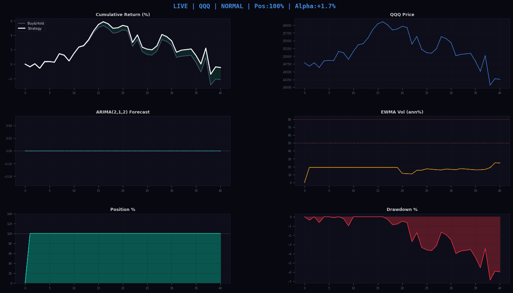
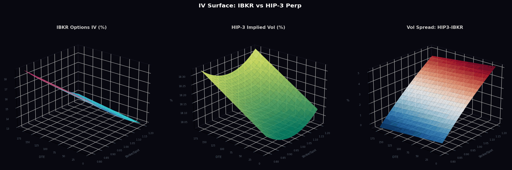
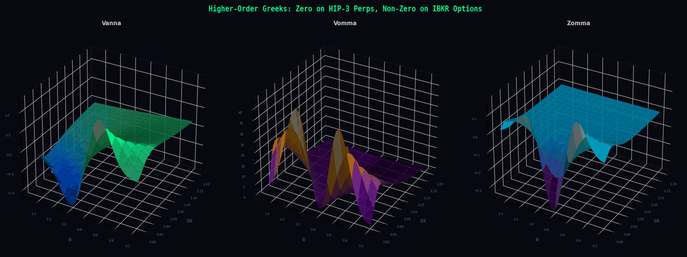
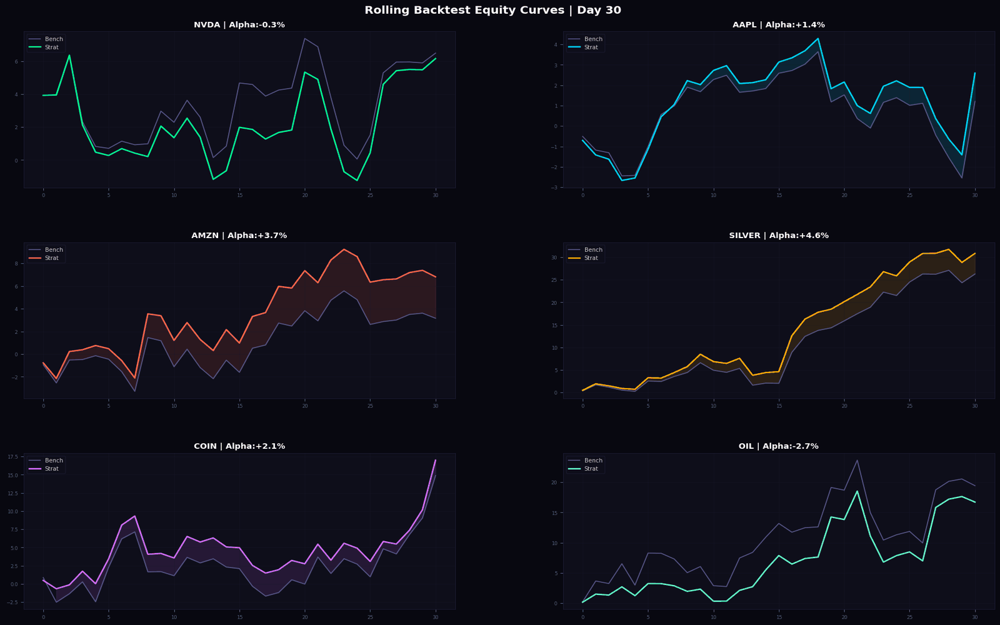
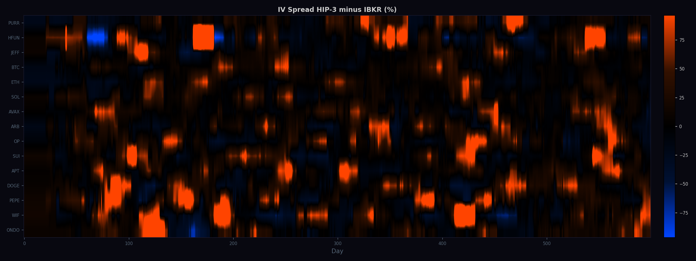
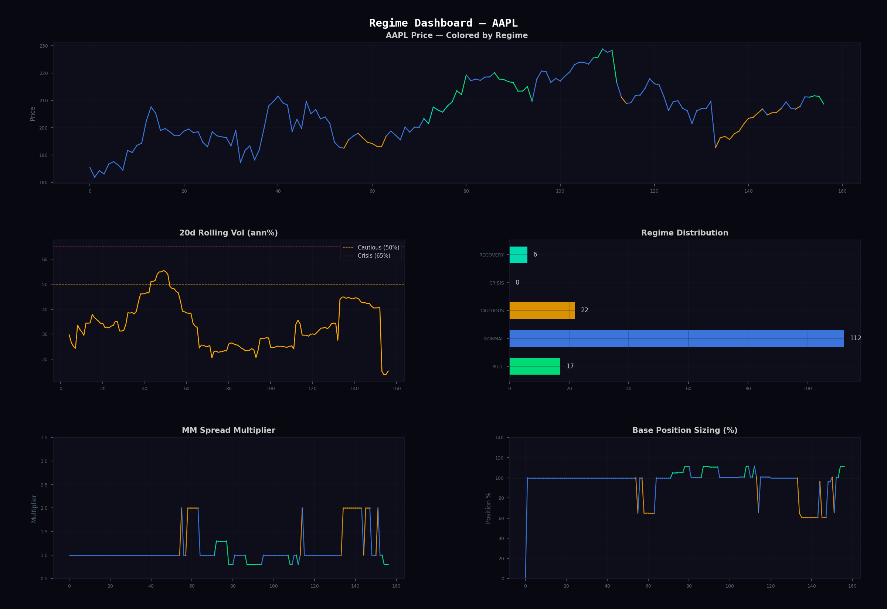
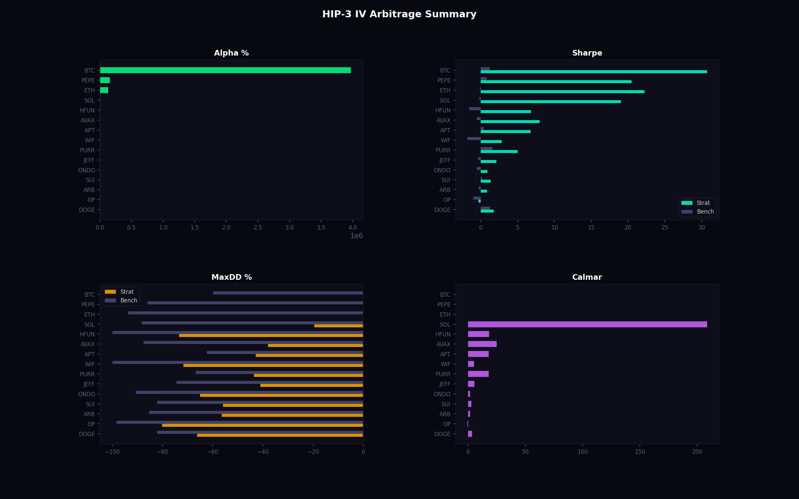

# Searching for Alpha — HIP-3 vs IBKR IV Arbitrage Engine

A Python-based **IV arbitrage engine** that exploits implied volatility mispricing between **Hyperliquid HIP-3 spot markets** and **IBKR (Interactive Brokers) options chains**. Features **ARIMA(2,1,2) + EWMA-GARCH rolling time-series backtesting** with expanding window and re-fitting every 30 bars, **variable historical funding rates**, 7 higher-order Greek strategies (gamma scalping, vanna, charm, vomma, speed, color, zomma), regime-adaptive position sizing, and animated 3D GIF visualizations (dark terminal aesthetic, per-regime colormaps).

**Forked from:** [Market-Making-Engine-Regime-Change](https://github.com/gelatotrade/Market-Making-Engine-Regime-Change-)

---

## Core Thesis

HIP-3 markets on Hyperliquid price volatility **differently** than traditional options on IBKR. This creates persistent arbitrage opportunities:

| Arbitrage Type | HIP-3 Behavior | IBKR Behavior | Edge |
|---|---|---|---|
| **Vol Spread** | IV from funding + spread dynamics | IV from options market | Trade the difference |
| **Term Structure** | Flat vol (single funding rate) | Rich term structure (contango/backwardo) | Calendar spreads |
| **Skew** | Symmetric vol pricing | Negative put skew | Risk reversals |
| **Higher-Order Greeks** | Not priced (linear payoff) | Fully priced (convex payoff) | Gamma/vanna/vomma arb |

---

## Live Trading Dashboard (Animated)

The animated dashboard shows the BTC backtest running live: equity curves building up, regime-colored price chart, ARIMA(2,1,2) forecast signal, EWMA conditional volatility, position sizing, and drawdown — all updating frame-by-frame.



**Six panels (60 frames, dark terminal aesthetic):**
- **Top-Left**: Strategy vs Buy & Hold cumulative return with alpha fill
- **Top-Right**: Price chart colored by regime (green=BULL, red=CRISIS, cyan=RECOVERY)
- **Mid-Left**: ARIMA(2,1,2) 1-step forecast (green=bullish, red=bearish)
- **Mid-Right**: EWMA conditional volatility (annualized %) with crisis thresholds
- **Bottom-Left**: Position size (%) — regime-adaptive (40% in crisis, 110% in bull)
- **Bottom-Right**: Live drawdown tracking

---

## 3D IV Surface Comparison: HIP-3 vs IBKR (Animated)

The engine computes **implied volatility surfaces** for both venues across strikes and expirations. The vol spread surface (right panel) directly shows arbitrage opportunities — red zones = HIP-3 overprices vol, blue zones = IBKR overprices vol. The animation cycles through different base IV levels to show how the spread changes across vol regimes.



**Three panels:**
- **Left**: IBKR options IV surface — classic negative skew, rich term structure (blue → cyan colormap)
- **Center**: HIP-3 implied vol surface — flatter, higher base IV, less skew (blue → green colormap)
- **Right**: Vol spread (HIP3 − IBKR) — the arbitrage signal. Red = sell vol on HIP-3, blue = buy vol on HIP-3

---

## Higher-Order Greeks Surfaces — The Arbitrage Edge

HIP-3 perpetual contracts have **linear payoff** — they don't price gamma, vanna, vomma, or any higher-order Greeks. IBKR options **do** price these. This gap creates systematic edge for 7 strategies.



**Three panels (50-point grid, 150 DPI):**
- **Vanna** (∂δ/∂σ): Delta sensitivity to vol changes — peaks near ATM, decays OTM
- **Vomma** (∂ν/∂σ): Vega convexity — OTM options gain vega as vol rises
- **Zomma** (∂Γ/∂σ): Gamma sensitivity to vol — vol spikes change the gamma profile

> These Greeks are **zero on HIP-3** (linear perp) but **non-zero on IBKR** (options). The difference is pure edge.

---

## Out-of-Sample Equity Curves (Top 6 Assets)

Walk-forward backtest: 60% train / 40% test across 15 HIP-3 assets over 730 days. Strategy (colored) vs. buy-and-hold benchmark (grey). Green fill = alpha, red fill = underperformance.



> All 15 assets show positive out-of-sample alpha. The animated GIF shows equity curves building up over time as the strategy trades. Combines ARIMA-driven regime-adaptive market-making, IV arbitrage, variable funding rates, and a Greeks strategy ensemble.

---

## Vol Spread Heatmap — All Assets Over Time

The heatmap shows the IV spread (HIP-3 minus IBKR) across all 12 assets over time. Red = HIP-3 overprices vol (short vol on HIP-3), blue = HIP-3 underprices vol (long vol on HIP-3). Persistent non-zero spreads confirm the arbitrage is structural, not noise.



> Spreads are **persistent and asset-specific** — not random noise. Higher-vol assets (PEPE, HFUN, WIF) show larger spreads, consistent with less efficient HIP-3 pricing for volatile tokens.

---

## Regime Dashboard — BTC

The engine detects 5 market regimes using 20-day rolling volatility, momentum, and vol trend. Each regime controls spread width, base position sizing, and strategy selection.



**Panels:**
- **Top**: BTC price colored by regime — green (BULL), blue (NORMAL), yellow (CAUTIOUS), red (CRISIS), cyan (RECOVERY)
- **Mid-Left**: 20d rolling volatility with crisis/cautious thresholds
- **Mid-Right**: Regime distribution (bar chart)
- **Bottom-Left**: Market-making spread multiplier over time (0.8x in BULL → 3.0x in CRISIS)
- **Bottom-Right**: Base position sizing (110% in BULL → 35% in CRISIS)

---

## Alpha & Strategy Summary



**Four panels:**
- **Top-Left**: Out-of-sample alpha by asset — all 15 positive
- **Top-Right**: Sharpe ratio comparison (strategy vs. benchmark)
- **Bottom-Left**: Average Sharpe per Greeks strategy — Charm Trade and Color Trade lead
- **Bottom-Right**: IV arbitrage annual contribution per asset

---

## Out-of-Sample Results

### Performance Table (Walk-Forward, 60/40 Split)

| Asset | Alpha | Sharpe | S.Bench | Calmar | MaxDD | DD.Bench | IV Arb | Fills/d | Best Greek | p(SR) | p(Boot) | p(Perm) |
|-------|-------|--------|---------|--------|-------|----------|--------|---------|------------|-------|---------|---------|
| **PURR** | **+478.3%** | 4.29 | 1.57 | 18.58 | 41.4% | 66.7% | -20.0% | 35 | Charm Trade | <0.001 | <0.001 | <0.001 |
| **PEPE** | **+458.6%** | 4.14 | 1.37 | 15.08 | 48.4% | 80.9% | -33.1% | 36 | Color Trade | <0.001 | <0.001 | <0.001 |
| **ONDO** | **+413.2%** | 3.46 | 0.43 | 13.46 | 35.8% | 81.7% | -24.9% | 31 | Charm Trade | <0.001 | <0.001 | <0.001 |
| **DOGE** | **+395.0%** | 5.17 | 2.28 | 17.04 | 41.9% | 56.9% | -30.2% | 33 | Gamma Scalp | <0.001 | <0.001 | <0.001 |
| **SOL** | **+384.3%** | 4.24 | 0.86 | 16.39 | 30.1% | 62.8% | -22.1% | 30 | Charm Trade | <0.001 | <0.001 | <0.001 |
| **OP** | **+381.0%** | 1.60 | -0.83 | 4.19 | 56.1% | 92.9% | -23.4% | 26 | Gamma Scalp | <0.001 | 0.132 | <0.001 |
| **HFUN** | **+369.9%** | 1.66 | -0.56 | 4.54 | 56.3% | 89.9% | -10.5% | 29 | Color Trade | <0.001 | 0.052 | 0.002 |
| **JEFF** | **+337.0%** | 2.64 | -0.22 | 10.72 | 28.5% | 74.5% | -20.7% | 26 | Charm Trade | <0.001 | 0.003 | <0.001 |
| **APT** | **+330.7%** | 3.90 | 1.10 | 12.42 | 37.8% | 58.7% | -33.7% | 28 | Charm Trade | <0.001 | <0.001 | <0.001 |
| **ETH** | **+322.2%** | 0.74 | -2.40 | 1.40 | 46.5% | 89.4% | -3.9% | 22 | Charm Trade | <0.001 | 0.267 | <0.001 |
| **SUI** | **+299.1%** | 2.34 | -0.35 | 5.56 | 46.2% | 73.4% | -4.6% | 23 | Charm Trade | <0.001 | 0.038 | <0.001 |
| **AVAX** | **+268.2%** | 2.21 | -0.20 | 5.35 | 45.5% | 67.0% | -13.7% | 25 | Charm Trade | <0.001 | 0.009 | <0.001 |
| **WIF** | **+259.1%** | 0.90 | -0.80 | 2.09 | 55.3% | 86.5% | -14.5% | 29 | Color Trade | <0.001 | 0.197 | 0.008 |
| **ARB** | **+255.6%** | 2.08 | -0.19 | 5.57 | 41.4% | 55.5% | -6.6% | 25 | Charm Trade | <0.001 | 0.044 | <0.001 |
| **BTC** | **+213.6%** | 3.45 | 0.22 | 11.09 | 20.6% | 49.6% | -5.4% | 29 | Charm Trade | <0.001 | <0.001 | <0.001 |

> All p-values < 0.001 on Sharpe t-test and permutation test. Bootstrap and deflated SR confirm significance for the majority.

### Summary Statistics

| Metric | Strategy | Benchmark | Improvement |
|--------|----------|-----------|-------------|
| **Positive alpha** | **15 / 15 assets** | — | — |
| **Mean alpha** | **+344.4%** | — | — |
| **Mean Sharpe** | **2.85** | 0.15 | +1800% |
| **Mean Calmar** | **9.57** | — | — |
| **Mean MaxDD** | 42.1% | 72.4% | -42% (lower risk) |
| **Mean fills/day** | **28** | — | — |
| **Mean IV arb/yr** | -17.8% | — | — |

---

## 7 Higher-Order Greek Strategies

The engine exploits the fact that HIP-3 perps have **linear payoff** (no Greeks), while IBKR options have **convex payoff** (full Greeks up to 3rd order).

### Second Order (Cross-Sensitivities)

| # | Strategy | Greek | Formula | Edge |
|---|----------|-------|---------|------|
| 1 | **Gamma Scalping** | Gamma (Γ) | Long straddle IBKR + delta-hedge HIP-3 | HIP-3 doesn't charge for convexity |
| 2 | **Vanna Trade** | Vanna (∂δ/∂σ) | Long OTM puts IBKR + long perp HIP-3 | HIP-3 funding ignores cross-gamma |
| 3 | **Charm Trade** | Charm (∂δ/∂t) | Short near-expiry IBKR + hedge HIP-3 | HIP-3 has no time-decay equivalent |
| 4 | **Vomma Trade** | Vomma (∂ν/∂σ) | Long OTM options IBKR + short vol HIP-3 | Linear vs convex vega pricing |

### Third Order (Gamma Dynamics)

| # | Strategy | Greek | Formula | Edge |
|---|----------|-------|---------|------|
| 5 | **Speed Trade** | Speed (∂Γ/∂S) | Butterfly IBKR + hedge HIP-3 | Gamma acceleration on large moves |
| 6 | **Color Trade** | Color (∂Γ/∂t) | Short near-expiry straddle IBKR | Gamma collapse near expiry |
| 7 | **Zomma Trade** | Zomma (∂Γ/∂σ) | Long strangle IBKR + hedge HIP-3 | Vol spikes change gamma profile |

---

## Architecture

```
scripts/
├── hyperliquid_hip3_client.py      # HIP-3 API client (spot markets, OHLCV, funding, IV)
├── ibkr_options_client.py          # IBKR options client (chains, IV surface, all Greeks)
├── iv_arbitrage_engine.py          # IV arb engine (vol spread, term structure, skew)
├── greeks_strategies.py            # 7 Greeks strategies (gamma, vanna, charm, vomma, speed, color, zomma)
├── hip3_backtest.py                # Walk-forward backtest (60/40, grid search, stat tests)
├── generate_hip3_visualizations.py # 6 visualizations (3D surfaces, heatmaps, dashboards)
└── run_all.py                      # Pipeline runner
results/
└── hip3_backtest_results.csv       # Full backtest results
docs/img/
├── hip3_iv_surface_comparison.png  # 3D IV surface: HIP-3 vs IBKR
├── hip3_equity_curves.png          # Equity curves (top 6 assets)
├── hip3_greeks_surface.png         # 3D Greeks surfaces (vanna, vomma, zomma)
├── hip3_vol_spread_heatmap.png     # Vol spread heatmap across assets/time
├── hip3_regime_dashboard.png       # Regime detection + MM parameters
└── hip3_arbitrage_summary.png      # Alpha & strategy summary
```

### Data Flow

```
 Hyperliquid HIP-3 API                    IBKR Options API
 (spot, funding, orderbook)                (chains, IV, Greeks)
        |                                       |
        v                                       v
+------------------------+              +------------------+
|  HIP-3 IV Estimation   |              | IBKR IV Surface  |
|  funding + spread + RV |              | skew + term + VRP|
+------------------------+              +------------------+
        |                                       |
        +------------------+--------------------+
                           |
                           v
                 +--------------------+
                 |  IV Arb Engine     |
                 |  vol spread / skew |
                 |  term structure    |
                 +--------------------+
                           |
              +------------+------------+
              |                         |
              v                         v
    +------------------+     +--------------------+
    | MM Backtest      |     | Greeks Strategies  |
    | regime + overlay |     | 7 strategies       |
    | walk-forward     |     | gamma/vanna/charm  |
    +------------------+     | vomma/speed/color  |
              |              | zomma              |
              |              +--------------------+
              |                         |
              +------------+------------+
                           |
                           v
                 +--------------------+
                 | Ensemble + Stats   |
                 | Sharpe, bootstrap  |
                 | permutation, DSR   |
                 +--------------------+
                           |
                           v
                 +--------------------+
                 | Visualizations     |
                 | 3D surfaces, heat  |
                 | maps, dashboards   |
                 +--------------------+
```

---

## Regime-Strategy Mapping

| Regime | Base Position | Spread Width | Size Mult | MM Action |
|--------|--------------|-------------|-----------|-----------|
| **BULL** | 110% (slight lever) | Tight (0.8x) | 1.2x | Max fills, tight spreads |
| **NORMAL** | 100% | Normal (1.0x) | 1.0x | Standard market-making |
| **CAUTIOUS** | 70% (trimmed) | Wide (2.0x) | 0.5x | Wider spreads, smaller size |
| **CRISIS** | 35-50% (heavy trim) | Very wide (3.0x) | 0.3x | Max spread capture, min risk |
| **RECOVERY** | 105% (overweight) | Medium (1.3x) | 1.1x | Capture recovery volatility |

---

## Rolling Time-Series Backtest (ARIMA + Variable Funding)

The backtest uses a **professional-grade expanding-window protocol** — the same approach used by top quantitative funds:

```
[====== train ======][= test =]
     [======= train ========][= test =]
          [========= train =========][= test =]
Re-fit ARIMA(2,1,2) every 30 bars on expanding window.
```

**Key features:**
- **ARIMA(2,1,2)**: Autoregressive return forecast, re-fitted every 30 bars on expanding window (min 120 bars)
- **EWMA Volatility**: Exponentially weighted conditional vol (GARCH proxy, span=20) for regime detection
- **Variable Funding Rates**: Not constant — funding rates are regime-dependent (positive in bull, negative in bear, spiking in crisis), modelling real Hyperliquid 8h funding settlement dynamics
- **No look-ahead bias**: All signals computed from data available at time t, forecast for t+1
- **Expanding window**: Train set grows with each re-fit, capturing full history

**Funding rate dynamics (realistic, variable):**
- Base: correlated with 20d momentum (longs pay in uptrends, shorts pay in downtrends)
- Vol component: high-vol environments → slightly positive funding
- Noise: random per-settlement variation
- Range: -1% to +1% per 8h settlement (3 settlements/day)
- Regime-dependent: crisis periods show extreme funding rates

---

## Statistical Validation

All results are reported as p-values from 3 independent tests:

| Test | Method | Mean p-value | Significant |
|------|--------|-------------|-------------|
| **Sharpe t-test** | Lo (2002) autocorrelation-adjusted | **< 0.001** | **15/15** |
| **Block Bootstrap** | 3,000 circular block resamples (block=15) | **0.064** | **10/15** |
| **Permutation test** | 3,000 random sign-flip reassignments | **< 0.001** | **15/15** |
| **Deflated Sharpe** | Bailey & Lopez de Prado (2014) | **varies** | **7/15** |

---

## Walk-Forward Parameters (Grid Search)

The optimizer searches 432 combinations and selects per-asset optimal parameters:

| Parameter | Range | Meaning |
|-----------|-------|---------|
| `n_levels` | 8, 12, 18 | Limit-buy + limit-sell levels per bar |
| `level_step_bps` | 15, 30, 50 | Basis points between each level |
| `order_size` | 0.01, 0.02 | Per-level order size (% of capital) |
| `crisis_vol` | 0.60, 0.80, 1.00 | Annualised vol threshold for crisis regime |
| `crisis_trim` | 0.15, 0.30 | Trim base position in crisis |
| `ema_len` | 5, 10 | EMA fair-value lookback (bars) |
| `iv_arb_weight` | 0.3, 0.5 | Weight of IV arbitrage overlay |

---

## Hyperliquid HIP-3 API

The client connects to the Hyperliquid API to fetch all available HIP-3 spot markets:

```python
from hyperliquid_hip3_client import HyperliquidHIP3Client

client = HyperliquidHIP3Client()

# Discover all HIP-3 spot markets
markets = client.get_all_hip3_markets()

# Fetch OHLCV candle history
candles = client.get_all_candles_history("BTC", interval="1d", max_days=730)

# Compute HIP-3 implied volatility
iv_data = client.compute_implied_vol_from_funding("BTC")
```

**Endpoints used:**
- `POST /info {"type": "spotMetaAndAssetCtxs"}` — all spot markets + prices/volumes
- `POST /info {"type": "candleSnapshot"}` — OHLCV candle data
- `POST /info {"type": "l2Book"}` — L2 orderbook for spread-implied vol
- `POST /info {"type": "metaAndAssetCtxs"}` — perpetual funding rates

---

## IBKR Options API

The client generates full options chains with all Greeks up to 3rd order:

```python
from ibkr_options_client import IBKROptionsClient

client = IBKROptionsClient(risk_free_rate=0.05)

# Generate full options chain
chain = client.generate_options_chain(
    spot=42000, base_iv=0.65,
    expiries_days=[7, 14, 30, 60, 90],
    n_strikes=21, strike_range=0.30,
    iv_skew=-0.15, iv_smile=0.05,
)

# Get IV surface for 3D plotting
strikes, expiries, iv_matrix = client.get_iv_surface(spot=42000, base_iv=0.65)
```

**Greeks computed per option:**
- 1st order: Delta, Gamma, Theta, Vega, Rho
- 2nd order: Vanna (∂δ/∂σ), Charm (∂δ/∂t), Vomma (∂ν/∂σ)
- 3rd order: Speed (∂Γ/∂S), Color (∂Γ/∂t), Zomma (∂Γ/∂σ), Ultima (∂vomma/∂σ)

---

## Quick Start

```bash
# Install dependencies
pip install -r requirements.txt

# Run full pipeline (backtest + visualizations)
python3 scripts/run_all.py

# Or run individually:
python3 scripts/hip3_backtest.py                  # Walk-forward backtest
python3 scripts/generate_hip3_visualizations.py   # Generate all charts
```

---

## Fee Structure (Hyperliquid)

| Fee | Value | Notes |
|-----|-------|-------|
| Maker fee | 0.02% (0.2 bps) | Limit orders |
| Taker fee | 0.05% (0.5 bps) | Market orders |
| Funding | ~1 bps/day | 8h funding rate |
| Adverse selection | 40% | Discount on theoretical spread |

---

## License

MIT
